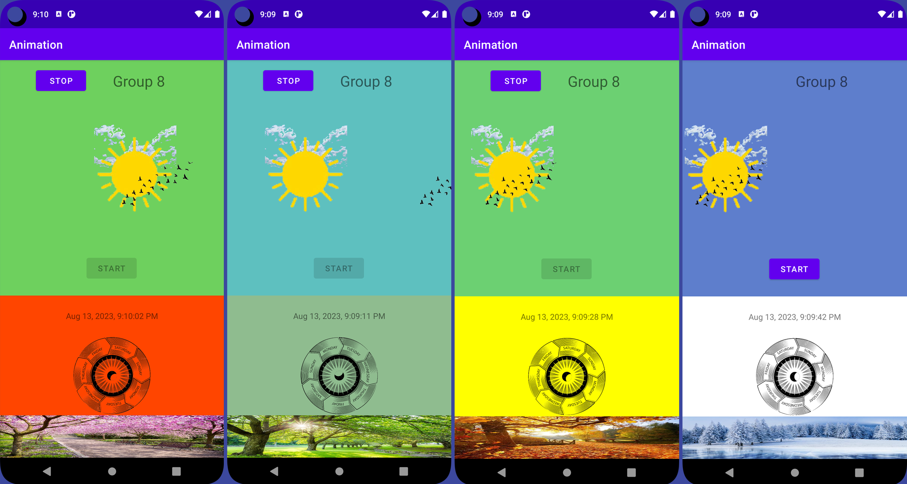

# Animation in Android

 <a href="https://kotlinlang.org" target="_blank" rel="noreferrer"> 
 

 
An android application that will combine animations, simple fragment and music.

## Tech-Stack

-   Kotlin
-   Fragment, Viewbinding
-   Animation, Mp3Player

## Screenshots

  

