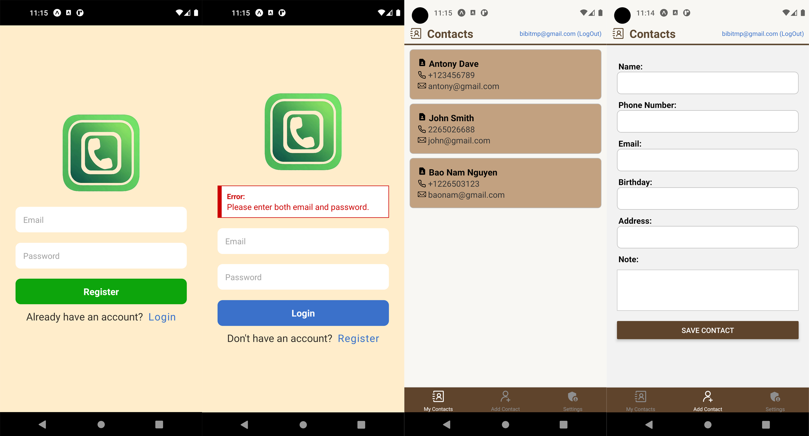

# Contacts App

 <a href="https://kotlinlang.org" target="_blank" rel="noreferrer"> 
 

 
This application allows users to search for business locations by keyword and city, province. And users can view the details of the business location on the map.

## Tech-Stack

-   React Native
-   Firebase Authentication (SignUp, Login, Logout), Firestore (to store consistent data)
-   Redux

## Screenshots

  

