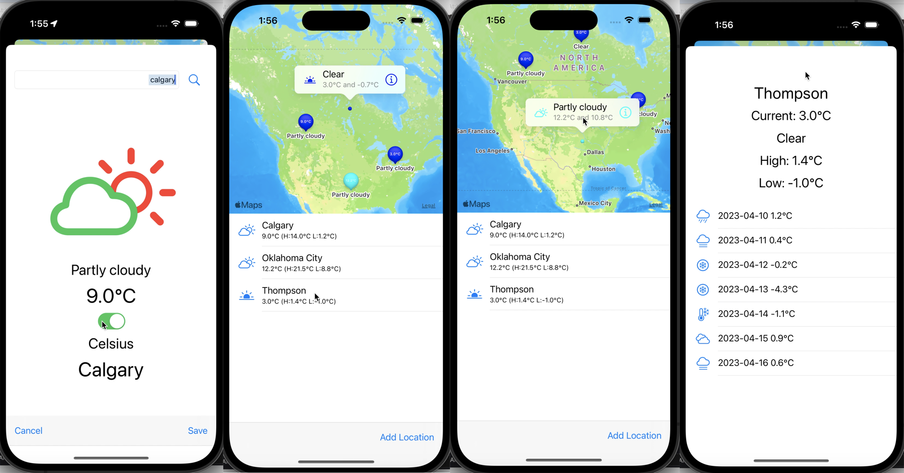

# Weather Forecast

<p>

 </p>
 
Weather App allow users to see the current temperature of their current location on a map. This data will be parsed from the provided JSON endpoint: 
```bash
https://api.weatherapi.com
```

-   Weather App allow users to see the current temperature of their current location on a map.
-   It will also allow users to see the future forecast.
-   Finally users will be able to look up other locations and add them to a list.

## Tech-Stack

-   Swift
-   UIKit, MapKit, CoreLocation

## Screenshots

<p float="left">
  
</p>
