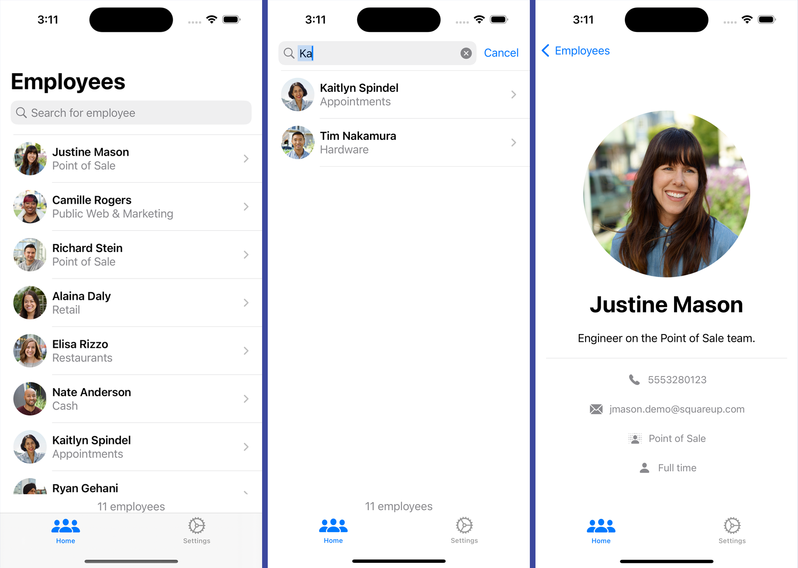

# List of Employees

<p>

 </p>
 
Build an employee directory app that shows a list of employees parsed from the provided JSON endpoint: 
```bash
https://s3.amazonaws.com/sq-mobile-interview/employees.json
```
- Not waste network bandwidth – load expensive resources such as large photos on-demand only. Photos at a given URL will never change. Once one is loaded, I do not need to reload the photo. If an employee’s photo changes.
- All screens and views which load from the network should display proper loading, empty, and error states when content is not available. If images fail to load, displaying a placeholder is fine.
- The employee list is not persisted to disk – reload it from the network on each app launch (but no more often than that). 
Images should be cached on disk as to not waste device bandwidth.

## Tech-Stack

-   SwiftUI
-   MVVM, ViewModel, AppStorage

## Screenshots

<p float="left">
  
</p>
